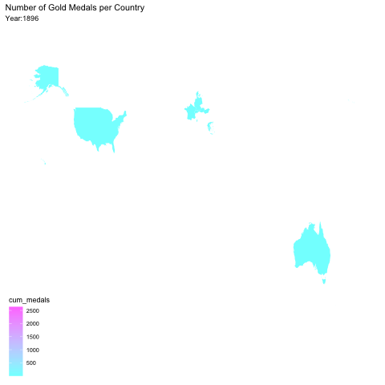

```{r, include=FALSE}
knitr::opts_chunk$set(echo = FALSE, error=FALSE, message=FALSE, warning=FALSE)

```


```{r libraries}
library(tidyverse)     # for data cleaning and plotting
library(lubridate)     # for date manipulation
library(openintro)     # for the abbr2state() function
library(maps)          # for map data
library(ggmap)         # for mapping points on maps
library(gplots)        # for col2hex() function
library(RColorBrewer)  # for color palettes
library(sf)            # for working with spatial data
library(leaflet)       # for highly customizable mapping
library(ggthemes)      
library(plotly)        # for the ggplotly() - basic interactivity
library(gganimate)     # for adding animation layers to ggplots
library(gifski)        # for creating the gif (don't need to load this library every time,but need it installed)
library(transformr)    # for "tweening" (gganimate)
library(shiny)         # for creating interactive apps
library(patchwork)     # for nicely combining ggplot2 graphs
library(gt)            # for creating nice tables
library(countrycode)
theme_set(theme_minimal())
library(tidytext)

```

Every four years (or two), the world holds its breath as individual humans represent whole countries through their mastery of a sport. We data scientists have analyzed the Summer Olympics from the year 1896 to 2016--yes, 120 years of the top athletes competing for the glory, and, perhaps more importantly, the gold. 


## Original Data

This data hails from Kaggle from the games in Athens 1896 to Rio 2016; more recently, it was popularized through the weekly R challenge "Tidy Tuesday." Until 1992, the Winter and Summer Games coincided in the same year, which results in odd data points like a Figure Skating victory slipping into the Summer Olympics data sets. Other aspects of the history of the Olympics include the existence and end to whole nations as the years progress. Examples include East and West Germany and the Soviet Union--as well as unrecognized independent territories such as Kosovo and Taiwan. Our team's methodology to eliminate our own biases was to keep the data points that reflect 2016's Olympic Games for sports measured and the countries recognized are universally agreed upon by the international community. 

```{r}
olympics <- readr::read_csv('https://raw.githubusercontent.com/rfordatascience/tidytuesday/master/data/2021/2021-07-27/olympics.csv')

world <- map_data("world")

medal_colors <- c(
  Gold = "#d5a500",
  Silver = "#b7b7b7",
  Bronze = "#a17419")

```


```{r}
summer_olympics <- olympics %>% 
  filter(season == "Summer") %>% 
   mutate(countryName = countrycode(noc, "genc3c", "country.name")) %>% 
   mutate(countryName = ifelse(countryName == "United States", "USA", countryName)) %>% 
   mutate(countryName = ifelse(noc == "ALG", "Algeria", countryName)) %>% 
   mutate(countryName = ifelse(noc == "BAH", "Bahamas", countryName)) %>%
   mutate(countryName = ifelse(noc == "BUL", "Bulgaria", countryName)) %>%
   mutate(countryName = ifelse(noc == "CHI", "Chile", countryName)) %>%
   mutate(countryName = ifelse(noc == "CRC", "Costa Rica", countryName)) %>%
   mutate(countryName = ifelse(noc == "CRO", "Croatia", countryName)) %>%
   mutate(countryName = ifelse(noc == "CZA", "Czech Republic", countryName)) %>%
   mutate(countryName = ifelse(noc == "DEN", "Denmark", countryName)) %>%
   mutate(countryName = ifelse(noc == "FIJ", "Fiji", countryName)) %>%
   mutate(countryName = ifelse(noc == "GER", "Germany", countryName)) %>%
   mutate(countryName = ifelse(noc == "GRE", "Greece", countryName)) %>%
   mutate(countryName = ifelse(noc == "GRN", "Grenada", countryName)) %>%
   mutate(countryName = ifelse(noc == "HAI", "Haiti", countryName)) %>%
   mutate(countryName = ifelse(noc == "INA", "Indonesia", countryName)) %>%
   mutate(countryName = ifelse(noc == "IRI", "Iran", countryName)) %>%
   mutate(countryName = ifelse(noc == "LAT", "Latvia", countryName)) %>%
   mutate(countryName = ifelse(noc == "MGL", "Mongolia", countryName)) %>%
   mutate(countryName = ifelse(noc == "NED", "Netherlands", countryName)) %>%
   mutate(countryName = ifelse(noc == "NGR", "Nigeria", countryName)) %>%
   mutate(countryName = ifelse(noc == "POR", "Portugal", countryName)) %>%
   mutate(countryName = ifelse(noc == "PUR", "Puerto Rico", countryName)) %>%
   mutate(countryName = ifelse(noc == "RSA", "South Africa", countryName)) %>%
   mutate(countryName = ifelse(noc == "SLO", "Slovenia", countryName)) %>%
   mutate(countryName = ifelse(noc == "SUI", "Switzerland", countryName)) %>%
   mutate(countryName = ifelse(noc == "UAE", "United Arab Emirates", countryName)) %>%
   mutate(countryName = ifelse(noc == "URU", "Uruguay", countryName)) %>%
   mutate(countryName = ifelse(noc == "VIE", "Vietnam", countryName)) %>%
   mutate(countryName = ifelse(noc == "ZIM", "Zimbabwe", countryName)) 


# Footnote or mention in part of the project the choice to leave out territories not fully recognized, such as Kosovo and Chinese Taipei, and countries that no longer exist, including the Soviet Union and Yugoslavia. 


summer_gold <- summer_olympics %>% 
  drop_na(medal) %>% 
  filter(medal == "Gold") 

summer_medals <- summer_olympics %>% 
  drop_na(medal)

medal_prop <- summer_olympics %>% 
  count(countryName, medal) %>% 
  group_by(countryName) %>% 
  filter(any(!is.na(medal))) %>% 
  mutate(medal = ifelse(is.na(medal), "No Medal", medal)) %>% 
  pivot_wider(
    names_from = medal,
    values_from = n,
    values_fill = 0) %>% 
  mutate(
    total_medals = Gold + Silver + Bronze,
    total_events = total_medals + `No Medal`,
    p_medal = total_medals / total_events) %>% 
  arrange(desc(total_medals))


```


```{r, echo=FALSE}

golden_girls <- summer_gold %>% 
  filter(sex == "F") %>% 
  drop_na(height, weight) 


```


## Felicia's Graphs

In sports, there is often a disparity between men's and women's events. Women often get more scrutinized, especially for their looks, or ignored due to perceived lack of athleticism. Olympian athletes are some of the most publicized figures, which impacts the type of person who can achieve victory. We wanted to understand what Olympic data shows us about the differences between Olympic athletes in different situation.

## 1. __Overall medals (gold, silver, and bronze) won by Olympians__


```{r, fig.height=5, fig.alt= "This bar graph shows the descending order of overall Olympic medals won based on gender. This feflects women not being allowed in competitions for a good portion of all Olympic Games. This graph is also skews heavily towards sports that naturally have more medals to win due to different events under the same sport category."}

summer_olympics %>%
  group_by(sex, sport) %>% 
  count(medal) %>% 
  filter(!(sport %in% c("Aeronautics", "Art Competitions", "Jeu De Paume", "Roque", "Alpinism", "Basque Pelota", "Croquet", "Racquets", "Figure Skating", "Ice Hockey", "Cricket", "Polo", "Trampolining", "Tug-Of-War", "Motorboating"))) %>% 
  ggplot(aes(x = n, y = reorder(sport, n), fill = sex)) + 
  geom_col() +
  labs(y = "",
        title = "Overall medals won by male and female Olympians",
       x = "")


```

In general, the net amount of medals won is favored by sports within which have multiple opportunities to medal. One example includes Athletics, also known as "Track and Field," having multiple races, team relays, and field events for athletes to earn medals in. Other result by contrasting by gender shows both the lack of female inclusion for a significant period of time, reflecting gender dynamics over the decades, as well as sports that are more dominated by one gender. Synchronized Swimming, Rhythmic Gymnastics appear to only have female champions, while Wrestling, the Modern Pentathlon, Rugby, and Lacrosse appear to have majority male winners.  


## 2. __Olympic medal winning women's heights and weights__

```{r, echo=FALSE}
#weight in kg
# Athletics = track and field
# Hockey = Field Hockey
#Leaving out figure skating because  1920s Olympics, one gold winner

golden_girls <- summer_medals %>% 
  filter(sex == "F") %>% 
  drop_na(height, weight) 

```


```{r, fig.height = 5, fig.width = 7, fig.alt= "This graph shows the heights and weights of women who competed in the Olympics and won a medal.", echo=FALSE}
golden_girls %>% 
  ggplot(aes(x = weight, y = height, color = sport)) +
  geom_point() + 
  labs(title = "Body Types of Olympic Medal Winning Female Athletes",
    y = "Height (cm)",
       x = "Weight (kg)") + 
  theme(legend.title = element_blank())
```

Above is a graph that shows all the female athletes in one graph, showing a wide range of heights and weights of Olympians. You can see there is a large range of body types on this graphes. However, due to the amount of sports, the graph itself is very noisy. To better understand the trends, the same data is compiled into four different categories:

The first category is "Holding an object": These athletes are holding onto something, whether it is the reigns of a horse or a racket, they are armed. 

The second is "Wearing protective gear." The athletes in this category are wearing an extra layer designed for their sport to reduce injury. 

The third is "In water." As it sounds, these athletes are found in the water to compete. 

Lastly, there is "Just self." These athletes are not holding anything, wearing something meant to protect them, or are in the water.


```{r, echo=FALSE}

equip_gg <- golden_girls %>% 
  filter(sport == c("Badminton", "Cycling", "Equestrianism", "Golf",  "Hockey", "Shooting", "Softball", "Table Tennis", "Tennis", "Rhythmic Gymnastics", "Weightlifting"))


armor_gg <- golden_girls %>% 
  filter(sport == c("Boxing", "Judo", "Fencing", "Football", "Taekwondo", "Rugby Sevens"))


hydro_gg <- golden_girls %>% 
  filter(sport == c("Canoeing", "Diving", "Water Polo", "Rowing", "Swimming", "Synchronized Swimming", "Sailing"))


solo_gg <- golden_girls %>%
  filter(sport == c("Athletics", "Basketball", "Beach Volleyball", "Gymnastics", "Handball", "Trampolining", "Triathalon", "Volleyball", "Wrestling" ))


```

```{r, fig.height= 7, fig.width = 7, fig.alt= "This is a series of graphs that filter out sports into four distinct categories.", echo=FALSE}
fig1 <- equip_gg %>% 
  ggplot(aes(x = weight, y = height, color = sport)) +
  geom_point() +
  theme(legend.title = element_blank(),
        legend.text = element_text(size = 7)) +
  labs(x = "",
       y = "")

fig2 <- armor_gg %>% 
  ggplot(aes(x = weight, y = height, color = sport)) +
  geom_point() +
  theme(legend.title = element_blank(),
        legend.text = element_text(size = 7)) +
  labs(x = "",
       y = "")
 

fig3 <- hydro_gg %>% 
  ggplot(aes(x = weight, y = height, color = sport)) +
  geom_point() +
  theme(legend.title = element_blank(),
        legend.text = element_text(size = 7)) + 
   labs(x = "Weight (cm)",
       y = "Height (kg)")

fig4 <- solo_gg %>% 
  ggplot(aes(x = weight, y = height, color = sport),
         legend.text = element_text(size = 7)) +
  geom_point() +
  theme(legend.title = element_blank(),
        legend.text = element_text(size = 7)) + 
  labs(y = "Height (cm)",
       x = "Weight (kg)")


fig1 + fig2 + fig3 + fig4 + 
  plot_annotation(title = "Olympic Medal Winning Women",
                  subtitle = "Trends in height and weight for female athletes depending on sport")
```


Holding an object: Out of the four categories, athletes who held objects to compete in their sport had the least significant relationship between height and weight. They are mostly under 80 kg, but their heights vary. 

Wearing protective gear: Most medal winning athletes in this category were between 160-180 cm and under 80 kg, unless they competed in Judo. Heavier weight seems to be advantageous for Judo competitors.

In water: Those in aquatic sports are noticeably taller as a general category than the other four. Most are 170cm or taller. Another general trend is that most athletes are under 80 kg, which reduces the range of weights that the other categories show. Most rowing medal winners are between 70-80 kg. Synchronized swimmers also have similar height/weight ratios, a bit taller than 170 cm and weighing around 60kg. 

Just self: This category shows

While there is no one perfect body type, there is a distinct pattern for the height/weight ratios pertaining to each sport.


## Gabby's Graph

```{r, echo=FALSE}
gold_na <- olympics %>% 
  filter(season == "Summer") %>% 
  drop_na(medal) %>% 
  filter(medal == "Gold") %>% 
   mutate(countryName = countrycode(noc, "genc3c", "country.name")) %>% 
   mutate(countryName = ifelse(countryName == "USA", "United States", countryName)) %>% 
   mutate(countryName = ifelse(noc == "ALG", "Algeria", countryName)) %>% 
   mutate(countryName = ifelse(noc == "BAH", "Bahamas", countryName)) %>%
   mutate(countryName = ifelse(noc == "BUL", "Bulgaria", countryName)) %>%
   mutate(countryName = ifelse(noc == "CHI", "Chile", countryName)) %>%
   mutate(countryName = ifelse(noc == "CRC", "Costa Rica", countryName)) %>%
   mutate(countryName = ifelse(noc == "CRO", "Croatia", countryName)) %>%
   mutate(countryName = ifelse(noc == "DEN", "Denmark", countryName)) %>%
   mutate(countryName = ifelse(noc == "FIJ", "Fiji", countryName)) %>%
   mutate(countryName = ifelse(noc == "GER", "Germany", countryName)) %>%
   mutate(countryName = ifelse(noc == "GRE", "Greece", countryName)) %>%
   mutate(countryName = ifelse(noc == "GRN", "Grenada", countryName)) %>%
   mutate(countryName = ifelse(noc == "HAI", "Haiti", countryName)) %>%
   mutate(countryName = ifelse(noc == "INA", "Indonesia", countryName)) %>%
   mutate(countryName = ifelse(noc == "IRI", "Iran", countryName)) %>%
   mutate(countryName = ifelse(noc == "LAT", "Latvia", countryName)) %>%
   mutate(countryName = ifelse(noc == "MGL", "Mongolia", countryName)) %>%
   mutate(countryName = ifelse(noc == "NED", "Netherlands", countryName)) %>%
   mutate(countryName = ifelse(noc == "NGR", "Nigeria", countryName)) %>%
   mutate(countryName = ifelse(noc == "POR", "Portugal", countryName)) %>%
   mutate(countryName = ifelse(noc == "PUR", "Puerto Rico", countryName)) %>%
   mutate(countryName = ifelse(noc == "RSA", "South Africa", countryName)) %>%
   mutate(countryName = ifelse(noc == "SLO", "Slovenia", countryName)) %>%
   mutate(countryName = ifelse(noc == "SUI", "Switzerland", countryName)) %>%
   mutate(countryName = ifelse(noc == "UAE", "United Arab Emirates", countryName)) %>%
   mutate(countryName = ifelse(noc == "URU", "Uruguay", countryName)) %>%
   mutate(countryName = ifelse(noc == "VIE", "Vietnam", countryName)) %>%
   mutate(countryName = ifelse(noc == "ZIM", "Zimbabwe", countryName)) %>% 
drop_na(countryName)

```
## 3. **Which countries have won the most gold medals?**

```{r, fig.height=8, fig.alt= "This graphs is a basic bar graph that shows us the number of gold medals earned by each participating country", echo=FALSE}
gold_na %>% 
  group_by(countryName) %>%
  count() %>% 
  ggplot(aes(x=n, y=reorder(countryName,n)))+
  geom_col()+
  labs(x="", y= "", title="Number of gold medals earned per country")

``` 

The map above gives us a basic idea of how many gold medals are earned per country in the olympics. It's very obvious that the United States outnumber every other country by far with the second and third place countries having over 1000 less.As the numbers of gold medals won decrease, it becomes harder to distinguish the count. While this graph gives us an idea of what countries dominate the summer olympics, we have little details on what events they are winning them in.

## 4. **When looking at countries that have won more than 20 gold medals, which sports have won the most gold medals for each country?**
```{r, fig.height=9, fig.width=15, fig.alt="This is a series of graphs focusing on only countries that have won more than 20 gold medals. Each country has a graph displaying which events have won the most gold medals in descending order", echo=FALSE}
gold_na%>% 
  group_by(countryName, sport) %>% 
  count() %>% 
  filter(n>20) %>% 
  ungroup %>% 
  mutate(sport2=reorder_within(sport,n,countryName)) %>% 
  ggplot(aes(x=n, y=sport2, fill=sport))+
  geom_col()+
  facet_wrap(vars(fct_reorder(countryName,n,sum,.desc = TRUE)),scales = "free_y")+
  scale_y_reordered()+
  labs(title="Countries that have won more than 20 gold medals")
```

Above is a series of 34 graphs, each graph represents a country that has won more than 20 gold medals, and displays what events they have received the gold medals in. These graphs give us a detailed look on the events that are winning the most gold medals for each country that we are looking at. These graphs allow us to compare and contrast the countries since they are all in one place, and easy to distinguish the sports because not only did we color code them, we included the names of them on the y-axis to make it easier. It's interesting to see which countries have won gold medals in only one sport, and what sport that is. By the same token, these graphs are multipurposeful because they show us how many sports each country has won gold medals in, and the distribution of those medals as well.


```{r, echo=FALSE}
summer_all <- olympics %>% 
  filter(season == "Summer") %>% 
   mutate(countryName = countrycode(noc, "genc3c", "country.name")) %>% 
   mutate(countryName = ifelse(countryName == "United States", "USA", countryName)) %>% 
   mutate(countryName = ifelse(noc == "ALG", "Algeria", countryName)) %>% 
   mutate(countryName = ifelse(noc == "BAH", "Bahamas", countryName)) %>%
   mutate(countryName = ifelse(noc == "BUL", "Bulgaria", countryName)) %>%
   mutate(countryName = ifelse(noc == "CHI", "Chile", countryName)) %>%
   mutate(countryName = ifelse(noc == "CRC", "Costa Rica", countryName)) %>%
   mutate(countryName = ifelse(noc == "CRO", "Croatia", countryName)) %>%
   mutate(countryName = ifelse(noc == "DEN", "Denmark", countryName)) %>%
   mutate(countryName = ifelse(noc == "FIJ", "Fiji", countryName)) %>%
   mutate(countryName = ifelse(noc == "GER", "Germany", countryName)) %>%
   mutate(countryName = ifelse(noc == "GRE", "Greece", countryName)) %>%
   mutate(countryName = ifelse(noc == "GRN", "Grenada", countryName)) %>%
   mutate(countryName = ifelse(noc == "HAI", "Haiti", countryName)) %>%
   mutate(countryName = ifelse(noc == "INA", "Indonesia", countryName)) %>%
   mutate(countryName = ifelse(noc == "IRI", "Iran", countryName)) %>%
   mutate(countryName = ifelse(noc == "LAT", "Latvia", countryName)) %>%
   mutate(countryName = ifelse(noc == "MGL", "Mongolia", countryName)) %>%
   mutate(countryName = ifelse(noc == "NED", "Netherlands", countryName)) %>%
   mutate(countryName = ifelse(noc == "NGR", "Nigeria", countryName)) %>%
   mutate(countryName = ifelse(noc == "POR", "Portugal", countryName)) %>%
   mutate(countryName = ifelse(noc == "PUR", "Puerto Rico", countryName)) %>%
   mutate(countryName = ifelse(noc == "RSA", "South Africa", countryName)) %>%
   mutate(countryName = ifelse(noc == "SLO", "Slovenia", countryName)) %>%
   mutate(countryName = ifelse(noc == "SUI", "Switzerland", countryName)) %>%
   mutate(countryName = ifelse(noc == "UAE", "United Arab Emirates", countryName)) %>%
   mutate(countryName = ifelse(noc == "URU", "Uruguay", countryName)) %>%
   mutate(countryName = ifelse(noc == "VIE", "Vietnam", countryName)) %>%
   mutate(countryName = ifelse(noc == "ZIM", "Zimbabwe", countryName)) %>% 
drop_na(countryName)
```

## 5. **What does the distribution of medals look like for the 10 highest medal earning countries?**
```{r, fig.alt="Below is a pair of graphs. The first graph shows the proportion of medals won by the top 10 countries . The second graph shows the number of medals won by the top 10 countries", echo=FALSE}
prop_of_medals<-summer_all %>% 
  drop_na(medal) %>% 
  filter(countryName %in% c("USA", "United Kingdom", "Germany", "France", "Italy", "Australia", "Hungary", "Sweden", "Netherlands", "China")) %>% 
  count(countryName, medal) %>% 
  group_by(countryName) %>% 
  mutate(proportion=n/sum(n)) 

graph1<-prop_of_medals %>% 
  ggplot(aes(y=countryName,x=proportion,fill=fct_relevel(medal,c("Bronze","Silver"))))+
  scale_fill_manual(values=c("Bronze"="#a17419",Silver = "#b7b7b7", Gold = "#d5a500"))+
  geom_col()+
  labs(title="Distribution of medals won by the top 10 countries",y="",x="Proportion", fill=NULL)


graph2<-prop_of_medals %>% 
  ggplot(aes(y=fct_reorder(countryName,n,sum),x=n,fill=fct_relevel(medal,c("Bronze","Silver"))))+
  scale_fill_manual(values=c("Bronze"="#a17419",Silver = "#b7b7b7", Gold = "#d5a500"))+
  geom_col()+
  theme(legend.title = element_blank())+
  labs(title = "Number of medals won by the top 10 countries", y="", x="Count", fill=NULL)


ggplotly(graph1)

graph2
```

Above are two graphs dealing with a similar concept, looking at earned medals as a whole for the 10 highest winning countries. Previous graphs have only focused on gold medals, while these two graphs bring in all three medals, providing us with a bigger picture. The first graph, the plotly, displays the distribution of medals won by the top 10 countries. Since this graph is proportional we can compare the amount of medals earned by countries by the percentage distribution of each medal. The second graph, gives us similar information but doesn't show the number of medals as proportions. Here we just see how many of each type of medal each of our top countries have won, in descending order. We can still somewhat estimate the proportion of each medal for each country but here we see which countries have the most medals once again.


## 6. **How have medals accumulated in each country over time?**


```{r}
olympics2 <- olympics %>% 
  select(noc, medal, year) %>% 
  drop_na(medal) %>% 
  filter(medal == "Gold") %>% 
  group_by(noc, year) %>% 
  summarize(n = n()) %>% 
  mutate(cum_medals = cumsum(n)) %>% 
  arrange(desc(n)) %>% 
  mutate(countryName = countrycode(noc, "genc3c", "country.name")) %>% 
  mutate(countryName = ifelse(countryName == "United States", "USA", countryName)) %>% 
  mutate(countryName = ifelse(noc == "ALG", "Algeria", countryName)) %>% 
   mutate(countryName = ifelse(noc == "BAH", "Bahamas", countryName)) %>%
   mutate(countryName = ifelse(noc == "BUL", "Bulgaria", countryName)) %>%
   mutate(countryName = ifelse(noc == "CHI", "Chile", countryName)) %>%
   mutate(countryName = ifelse(noc == "CRC", "Costa Rica", countryName)) %>%
   mutate(countryName = ifelse(noc == "CRO", "Croatia", countryName)) %>%
   mutate(countryName = ifelse(noc == "DEN", "Denmark", countryName)) %>%
   mutate(countryName = ifelse(noc == "FIJ", "Fiji", countryName)) %>%
   mutate(countryName = ifelse(noc == "GER", "Germany", countryName)) %>%
   mutate(countryName = ifelse(noc == "GRE", "Greece", countryName)) %>%
   mutate(countryName = ifelse(noc == "GRN", "Grenada", countryName)) %>%
   mutate(countryName = ifelse(noc == "HAI", "Haiti", countryName)) %>%
   mutate(countryName = ifelse(noc == "INA", "Indonesia", countryName)) %>%
   mutate(countryName = ifelse(noc == "IRI", "Iran", countryName)) %>%
   mutate(countryName = ifelse(noc == "LAT", "Latvia", countryName)) %>%
   mutate(countryName = ifelse(noc == "MGL", "Mongolia", countryName)) %>%
   mutate(countryName = ifelse(noc == "NED", "Netherlands", countryName)) %>%
   mutate(countryName = ifelse(noc == "NGR", "Nigeria", countryName)) %>%
   mutate(countryName = ifelse(noc == "POR", "Portugal", countryName)) %>%
   mutate(countryName = ifelse(noc == "PUR", "Puerto Rico", countryName)) %>%
   mutate(countryName = ifelse(noc == "RSA", "South Africa", countryName)) %>%
   mutate(countryName = ifelse(noc == "SLO", "Slovenia", countryName)) %>%
   mutate(countryName = ifelse(noc == "SUI", "Switzerland", countryName)) %>%
   mutate(countryName = ifelse(noc == "UAE", "United Arab Emirates", countryName)) %>%
   mutate(countryName = ifelse(noc == "URU", "Uruguay", countryName)) %>%
   mutate(countryName = ifelse(noc == "VIE", "Vietnam", countryName)) %>%
   mutate(countryName = ifelse(noc == "ZIM", "Zimbabwe", countryName))

world_map <- map_data("world")

map_olympics <- olympics2 %>% 
  ggplot()+
  geom_map(map = world_map,
           aes(map_id = countryName,
               fill = cum_medals)) +
  expand_limits(x = world_map$long, y = world_map$lat) +
  scale_fill_gradient(low=cm.colors(20)[1], high=cm.colors(20)[20])+
  theme_map() +
  labs(title = "Number of Gold Medals per Country",
       subtitle = "Year:{frame_along}" ) +
  transition_reveal(as.integer(year)) 

anim_map_olympics <- animate(map_olympics)

anim_save("animmapolympic.gif", anim_map_olympics)
```


```{r}

```

In the animation above, you can see the medals accumulate since the beginning of the Olympics, which began in 1896 in Athens. It shows that the first countries to receive medals were mainly western countries, and the countries that accumulated the most medals were also western countries, particularly the US. It is interesting to see that countries would pop up throughout time, meaning that it was the first time they won a gold medal in the Olympics, but also signifying that it was one of the first times that athletes from this country were involved in the Olympics.

## 8. __World map showing the proportion of Olympic medal wins to participation in events__

```{r, fig.width = 7, fig.alt="This world map shows the proportion of Olympic medal wins to participation in events per country. The United States has the largest proportion of medal earnings to individual participation in the Olympics, followed by Russia, Germany, and Finland.", echo=FALSE}

medal_prop %>% 
  mutate(countryName = ifelse(countryName == "United States", "USA", countryName)) %>% 
  ggplot() +
  geom_map(map = world, 
           aes(map_id = countryName,
               fill = p_medal)) +
  scale_fill_gradient(low=cm.colors(20)[1], high=cm.colors(20)[20])+
  #scale_colour_manual(values = countryName, na.value = "#34521") + 
  expand_limits(x = world$long, y = world$lat) +
  theme_map() +
  labs(fill = "Proportion of Medals") +
  theme(legend.key = element_rect(fill = "transparent"))
 
```

The map above adds depth to our understanding of Olympic medal winning countries. Previous maps show an extreme domination in the Olympics by the United States of America, but taking the wins in relation to total participation, other countries emerge as prolific medal winners as well. Russia, Finland, Germany, and China also tend to win more often when their athletes are competing. The United States still is at the highest level of medal wins. One other aspect to note are all the medals won by countries that no longer exist today, like the USSR and East and West Germany. This graph tells a more accurate story of where champions are from, but cannot wholly depict the wins every achieved in the world. 


## 9. **Where have the Olympics been located?**

```{r}
olympic_coordinates <- tibble(
  place = c("Paris","London","Beijing","Stockholm","Melbourne","Sydney","Atlanta","Moskva","Seoul","Los Angeles","Roma","Munich","Barcelona","St. Louis","Athina","Rio de Janeiro","Antwerpen","Montreal","Berlin","Helsinki","Tokyo","Amsterdam","Mexico City"),
  long = c(2.3483915, 0.1276, 116.4074,18.0686, 144.9631, 151.2093,-84.3880, 37.6173, 126.9780, -118.2437, 12.4964, 11.5820, 2.1686, -90.1994, 23.7275, -43.1729, 4.4051, -73.5673, 13.4050, 24.9384, 139.6503, 4.9041, -99.1332),
  lat = c(48.8534951, 51.5072, 39.9042, 59.3293, -37.8136, -33.8688, 33.7490, 55.7558, 37.5665, 34.0522, 41.9028, 48.1351, 41.3874, 38.6270, 37.9838, -22.9068, 51.2213, 45.5017, 52.5200, 60.1699, 35.6762, 52.3676, 19.4326))

location_olympics <- summer_gold %>%
  select(year, city) %>%
  distinct(city) %>% pull(city)

leaflet(data = olympic_coordinates) %>% 
  addTiles() %>% 
  addCircles(lng = ~long,
             lat = ~lat,
             label = ~place,
             weight = 6)
```

From the circles in the map above, we can see that most of the Olympics have been located in Europe and the United States. Only one South American city has hosted the Olympics, which was Rio de Janeiro, Brazil. Throughout these Olympics, various issues occurred, including the destruction of houses located in favelas. Though it is important to have the Olympics in various locations around the world, as  it is an international event, it is also crucial to understand the implications and consequences of hosting the Olympics.


