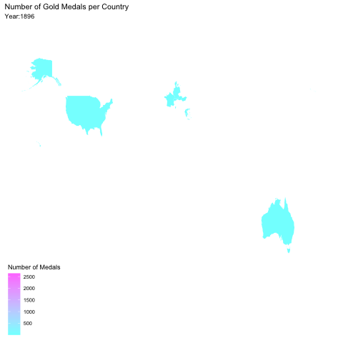

```{r setup, include=FALSE}
knitr::opts_chunk$set(echo = TRUE)
```

##Mapping the Medals
How have medals accumulated in each country over time?


```{r}
olympics2 <- olympics %>% 
  select(noc, medal, year) %>% 
  drop_na(medal) %>% 
  filter(medal == "Gold") %>% 
  group_by(noc, year) %>% 
  summarize(n = n()) %>% 
  mutate(cum_medals = cumsum(n)) %>% 
  arrange(desc(n)) %>% 
  mutate(countryName = countrycode(noc, "genc3c", "country.name")) %>% 
  mutate(countryName = ifelse(countryName == "United States", "USA", countryName)) %>% 
  mutate(countryName = ifelse(noc == "ALG", "Algeria", countryName)) %>% 
   mutate(countryName = ifelse(noc == "BAH", "Bahamas", countryName)) %>%
   mutate(countryName = ifelse(noc == "BUL", "Bulgaria", countryName)) %>%
   mutate(countryName = ifelse(noc == "CHI", "Chile", countryName)) %>%
   mutate(countryName = ifelse(noc == "CRC", "Costa Rica", countryName)) %>%
   mutate(countryName = ifelse(noc == "CRO", "Croatia", countryName)) %>%
   mutate(countryName = ifelse(noc == "DEN", "Denmark", countryName)) %>%
   mutate(countryName = ifelse(noc == "FIJ", "Fiji", countryName)) %>%
   mutate(countryName = ifelse(noc == "GER", "Germany", countryName)) %>%
   mutate(countryName = ifelse(noc == "GRE", "Greece", countryName)) %>%
   mutate(countryName = ifelse(noc == "GRN", "Grenada", countryName)) %>%
   mutate(countryName = ifelse(noc == "HAI", "Haiti", countryName)) %>%
   mutate(countryName = ifelse(noc == "INA", "Indonesia", countryName)) %>%
   mutate(countryName = ifelse(noc == "IRI", "Iran", countryName)) %>%
   mutate(countryName = ifelse(noc == "LAT", "Latvia", countryName)) %>%
   mutate(countryName = ifelse(noc == "MGL", "Mongolia", countryName)) %>%
   mutate(countryName = ifelse(noc == "NED", "Netherlands", countryName)) %>%
   mutate(countryName = ifelse(noc == "NGR", "Nigeria", countryName)) %>%
   mutate(countryName = ifelse(noc == "POR", "Portugal", countryName)) %>%
   mutate(countryName = ifelse(noc == "PUR", "Puerto Rico", countryName)) %>%
   mutate(countryName = ifelse(noc == "RSA", "South Africa", countryName)) %>%
   mutate(countryName = ifelse(noc == "SLO", "Slovenia", countryName)) %>%
   mutate(countryName = ifelse(noc == "SUI", "Switzerland", countryName)) %>%
   mutate(countryName = ifelse(noc == "UAE", "United Arab Emirates", countryName)) %>%
   mutate(countryName = ifelse(noc == "URU", "Uruguay", countryName)) %>%
   mutate(countryName = ifelse(noc == "VIE", "Vietnam", countryName)) %>%
   mutate(countryName = ifelse(noc == "ZIM", "Zimbabwe", countryName))

world_map <- map_data("world")

map_olympics <- olympics2 %>% 
  ggplot()+
  geom_map(map = world_map,
           aes(map_id = countryName,
               fill = cum_medals)) +
  expand_limits(x = world_map$long, y = world_map$lat) +
  scale_fill_gradient(low=cm.colors(20)[1], high=cm.colors(20)[20])+
  theme_map() +
  labs(title = "Number of Gold Medals per Country",
       subtitle = "Year:{frame_along}" ) +
  transition_reveal(as.integer(year)) 

anim_map_olympics <- animate(map_olympics)

anim_save("animmapolympic.gif", anim_map_olympics)
```


```{r}

```
In the animation above, you can see the medals accumulate since the beginning of the Olympics, which began in 1896 in Athens. It shows that the first countries to receive medals were mainly western countries, and the countries that accumulated the most medals were also western countries, particularly the US. It is interesting to see that countries would pop up throughout time, meaning that it was the first time they won a gold medal in the Olympics, but also signifying that it was one of the first times that athletes from this country were involved in the Olympics. Perhaps, wen we evaluate the athletic capabilities of each country, we should take into account the resources that certain countries posses that allow them to send multitudenous athletes to the Olympics.

##Mapping the Olympics
Where have the Olympics been located?

```{r}
olympic_coordinates <- tibble(
  place = c("Paris","London","Beijing","Stockholm","Melbourne","Sydney","Atlanta","Moskva","Seoul","Los Angeles","Roma","Munich","Barcelona","St. Louis","Athina","Rio de Janeiro","Antwerpen","Montreal","Berlin","Helsinki","Tokyo","Amsterdam","Mexico City"),
  long = c(2.3483915, 0.1276, 116.4074,18.0686, 144.9631, 151.2093,-84.3880, 37.6173, 126.9780, -118.2437, 12.4964, 11.5820, 2.1686, -90.1994, 23.7275, -43.1729, 4.4051, -73.5673, 13.4050, 24.9384, 139.6503, 4.9041, -99.1332),
  lat = c(48.8534951, 51.5072, 39.9042, 59.3293, -37.8136, -33.8688, 33.7490, 55.7558, 37.5665, 34.0522, 41.9028, 48.1351, 41.3874, 38.6270, 37.9838, -22.9068, 51.2213, 45.5017, 52.5200, 60.1699, 35.6762, 52.3676, 19.4326))

location_olympics <- summer_gold %>%
  select(year, city) %>%
  distinct(city) %>% pull(city)

leaflet(data = olympic_coordinates) %>% 
  addTiles() %>% 
  addCircles(lng = ~long,
             lat = ~lat,
             label = ~place,
             weight = 6)